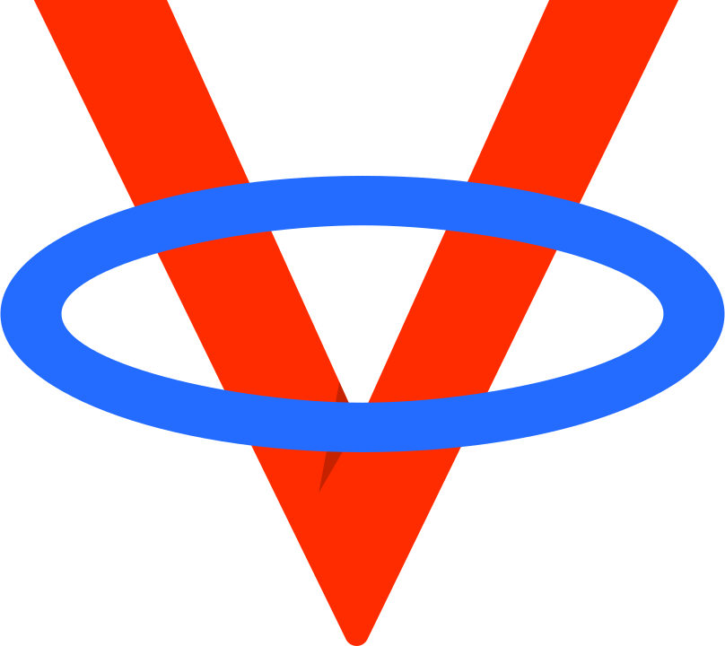

# VALO 

VALO is a URL shortener redirect service that also supports proxying files from a S3 storage bucket.

> If you are interested in VALO but find the documentation lacking, open an issue!

## Set up

Setting up VALO requires experience with Cloudflare workers. VALO is known to work on Backblaze, but will likely work with other S3 compatible storage buckets.

1. Create a Backblaze B2 bucket (or S3 bucket)
2. Deploy `worker/index.js` to Cloudflare
3. Create the `LINKS` & `ANALYTICS` KV namespaces on your Cloudflare worker
4. Add the `ACCESS_KEY_ID`, `SECRET_ACCESS_KEY`, & `BUCKET_URL` secrets to your Cloudflare worker
5. Visit [the admin panel](https://valo.vercel.app/) & connect

## Developing

### Cloudflare Worker

To run using [wrangler](https://github.com/cloudflare/wrangler):

```
cd worker
wrangler dev
```

### SvelteKit

Once you've installed dependencies with `npm install`, start a development server:

```bash
npm run dev
```